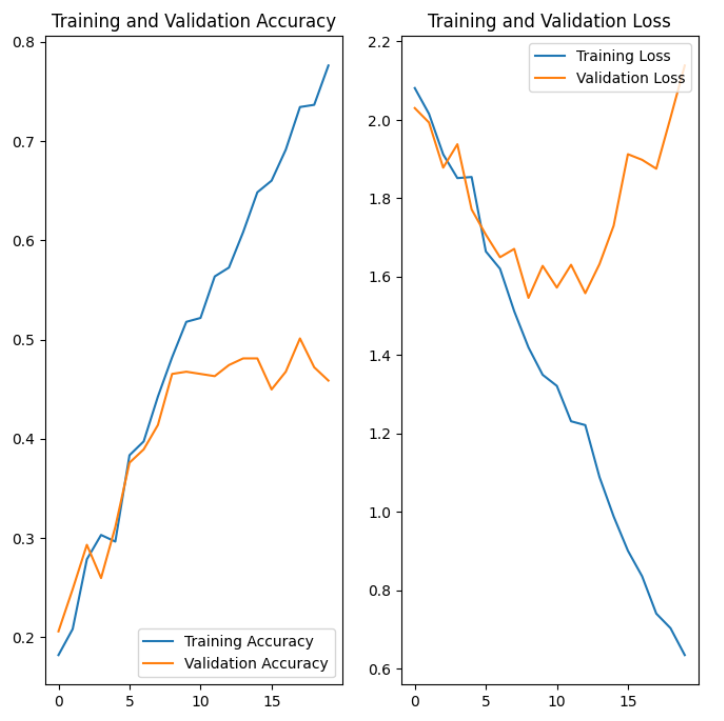
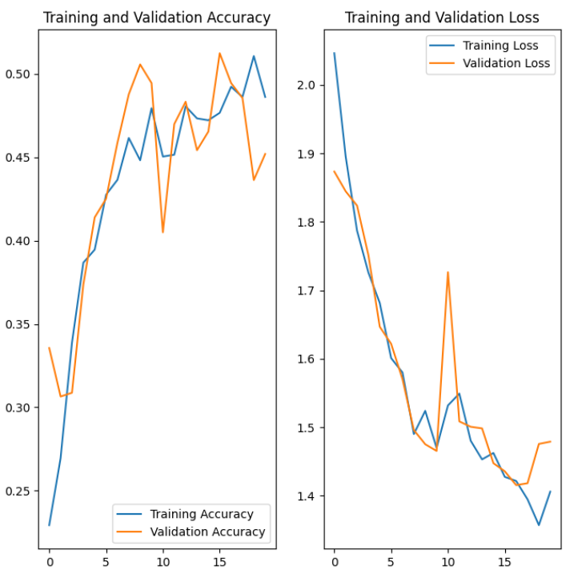
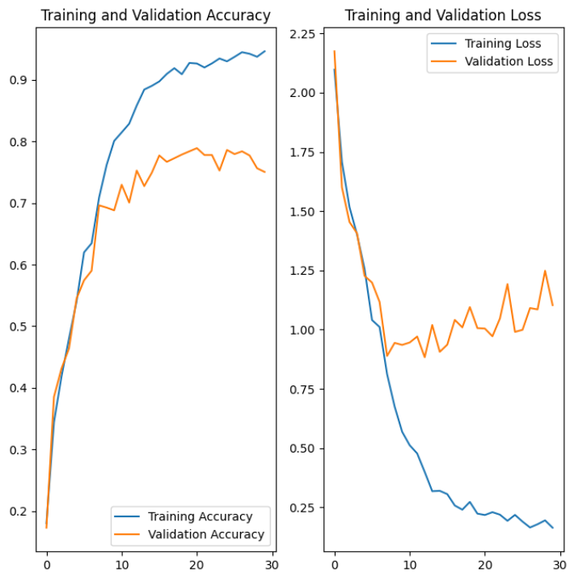

# Melanoma-Detection-using-using-custom-cnn
>
> This project uses a custom CNN to detect melanoma in images of skin lesions among 10 classes. The Gradio library is used to create a web app for the model prediction. The model predicts with an 87% accuracy.

## Table of Contents

- [Melanoma-Detection-using-using-custom-cnn](#melanoma-detection-assignment-using-custom-cnn)
  - [Table of Contents](#table-of-contents)
  - [General Information](#general-information)
    - [Algorithms Used](#algorithms-used)
    - [Dataset Information](#dataset-information)
  - [Steps Involved](#steps-involved)
  - [Results](#results)
    - [Baseline Model](#baseline-model)
    - [Augmented Model](#augmented-model)
    - [Final Model](#final-model)
- [Conclusion](#conclusion)
- [Technologies Used](#technologies-used)
- [Contact](#contact)
- [License](#license)

<!-- You can include any other section that is pertinent to your problem -->

## General Information

### Algorithms Used

Convolutional Neural Network

### Dataset Information

The dataset consists of 2357 images of malignant and benign oncological diseases, which were formed by the International Skin Imaging Collaboration (ISIC). All images were sorted according to the classification taken with ISIC, and all subsets were divided into the same number of images, with the exception of melanomas and moles, whose images are slightly dominant.

The data set contains the following diseases:

- Actinic keratosis
- Basal cell carcinoma
- Dermatofibroma
- Melanoma
- Nevus
- Pigmented benign keratosis
- Seborrheic keratosis
- Squamous cell carcinoma
- Vascular lesion

## Steps Involved

- Data Loading
- Baseline Model Building
- Training the Model and testing the model
- Building an augmented model
- Training the augmented model and testing the model
- Countering Class Imbalance with augmentor
- Building the final model
- Training the final model and testing the model
- Verifying the model

## Results

### Baseline Model

Accuracy and Loss charts for the baseline model

### Augmented Model

Accuracy and Loss charts for the augmented model

### Final Model

Accuracy and Loss charts for the final model

# Conclusion

As the accuracy of the model increases, the loss decreases. The final model has an accuracy of 94% and a loss of 0.18%. The model is able to predict the class of the lesion with a high accuracy.
Augmenting the data and countering class imbalance helped in improving the accuracy of the model.

# Technologies Used

- Python
- Tensorflow
- Keras
- Augmentor
- Matplotlib
- NumPy

# Contact

Created by [@suma2128]

# License

This project is open source and available under the [MIT License](LICENSE).

[//]: # (These are reference links used in the body of this note and get stripped out when the markdown processor does its job. There is no need to format nicely because it shouldn't be seen. Thanks SO - http://stackoverflow.com/questions/4823468/store-comments-in-markdown-syntax)
